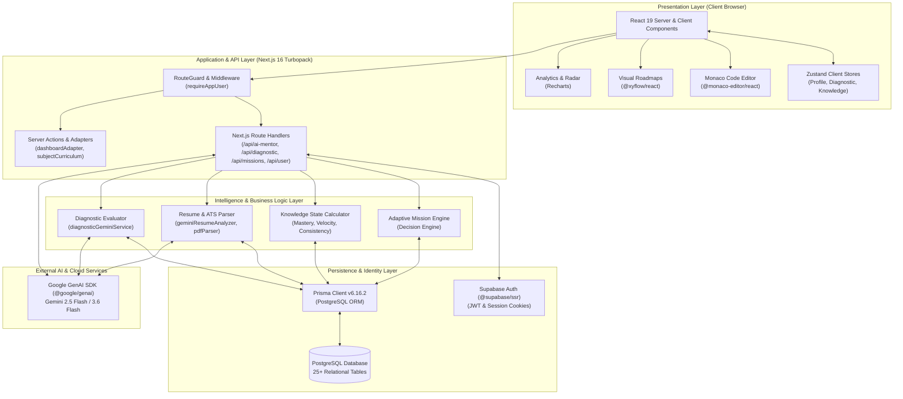
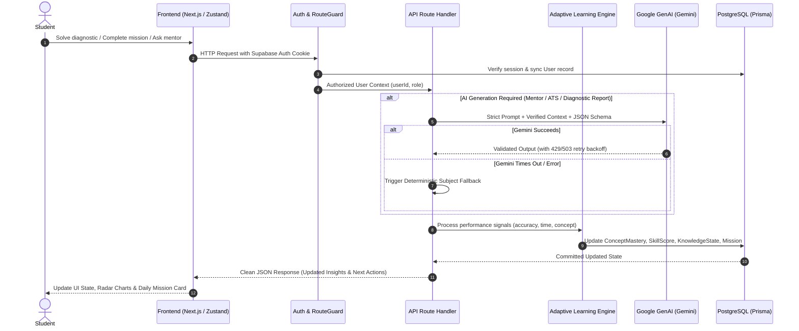
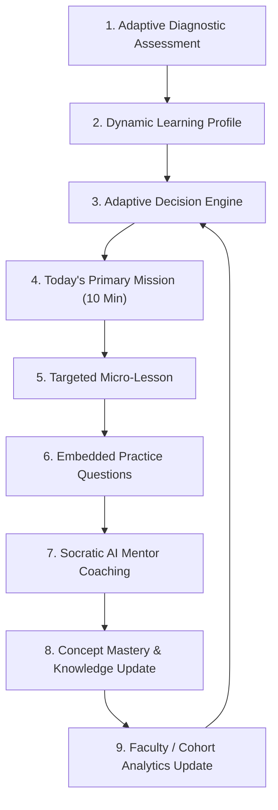
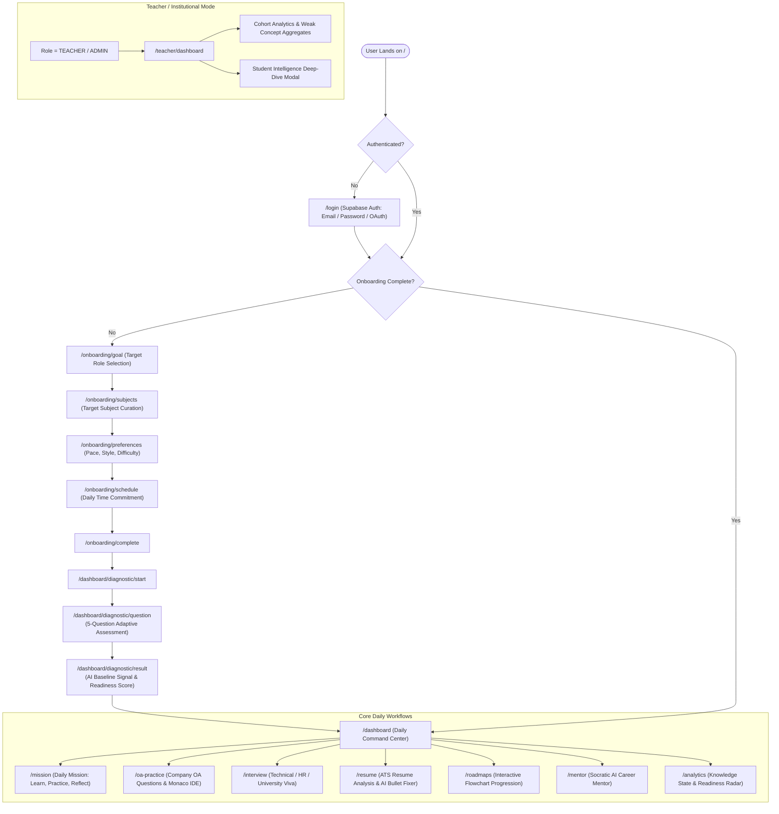
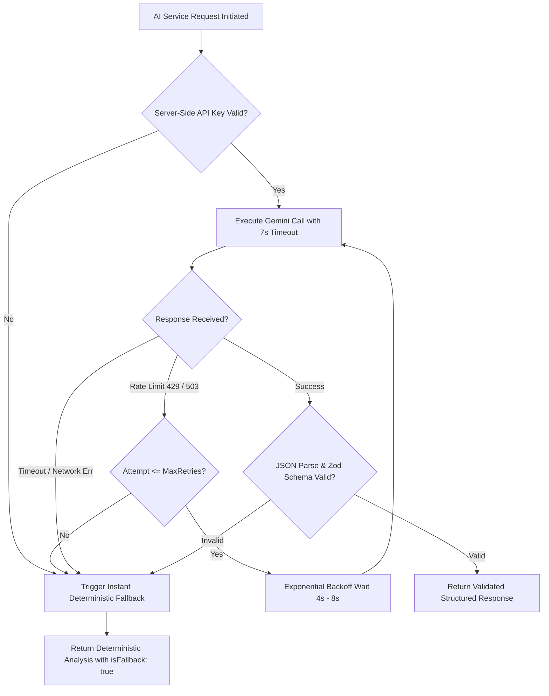
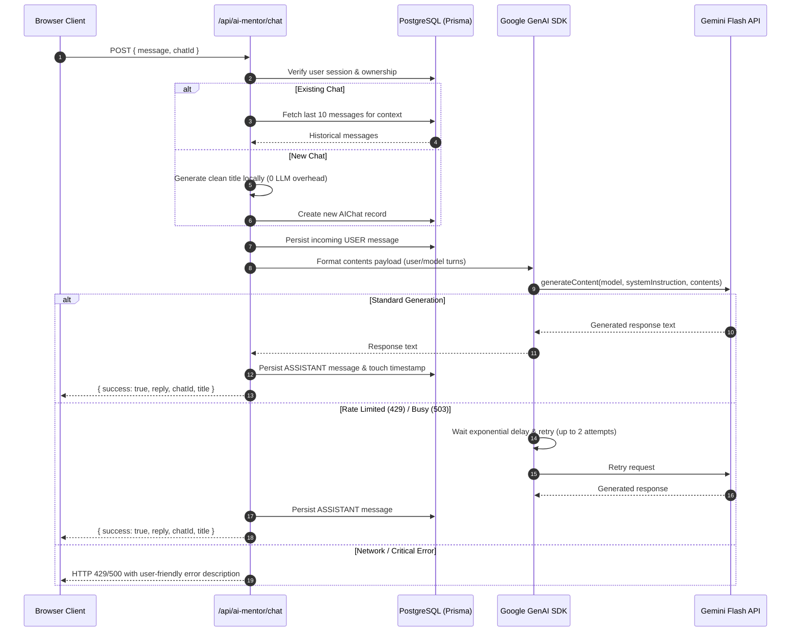
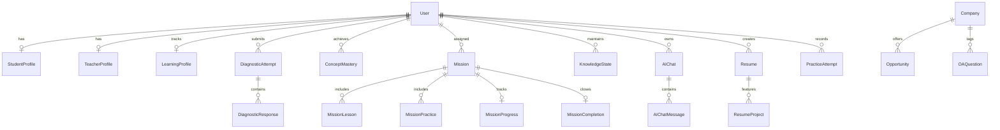

# 🚀 Cevora

<div align="center">


### AI-Powered Placement Intelligence & Adaptive Learning Platform

*Unifying scattered campus placement preparation into a decision-first, personalized command center.*

[](https://nextjs.org/)
[](https://react.dev/)
[](https://www.typescriptlang.org/)
[](https://tailwindcss.com/)
[](https://www.prisma.io/)
[](https://supabase.com/)
[](https://ai.google.dev/)
[](https://opensource.org/licenses/MIT)

[Explore Documentation](#-documentation-navigation) • [System Architecture](#-system-architecture) • [Getting Started](#-setup-and-installation) • [API Reference](#-api-documentation) • [Contributing](#-contributing)

</div>

---

## 📋 Table of Contents

- [Overview](#-overview)
  - [What is Cevora?](#what-is-cevora)
  - [The Problem](#the-problem)
  - [The Solution: Decision-First Learning](#the-solution-decision-first-learning)
  - [Core Product Philosophy](#core-product-philosophy)
- [System Architecture](#-system-architecture)
  - [High-Level Architectural Diagram](#high-level-architectural-diagram)
  - [Architectural Layers](#architectural-layers)
- [How Cevora Works](#-how-cevora-works)
  - [End-to-End System Flow](#end-to-end-system-flow)
  - [The Adaptive Learning Loop](#the-adaptive-learning-loop)
- [Complete User Flow](#-complete-user-flow)
- [Core Features](#-core-features)
  - [1. Daily Command Center & Adaptive Missions](#1-daily-command-center--adaptive-missions)
  - [2. Diagnostic Baseline Assessment Engine](#2-diagnostic-baseline-assessment-engine)
  - [3. AI Career Mentor](#3-ai-career-mentor)
  - [4. AI Resume & ATS Intelligence](#4-ai-resume--ats-intelligence)
  - [5. AI Interview & Viva Simulator](#5-ai-interview--viva-simulator)
  - [6. Placement Company Intelligence](#6-placement-company-intelligence)
  - [7. Online Assessment (OA) Coding Playground](#7-online-assessment-oa-coding-playground)
  - [8. Interactive Visual Roadmaps](#8-interactive-visual-roadmaps)
  - [9. Institutional Teacher Dashboard](#9-institutional-teacher-dashboard)
- [AI Integration Architecture](#-ai-integration-architecture)
  - [Providers & Models](#providers--models)
  - [Prompt Engineering & Safety Ladders](#prompt-engineering--safety-ladders)
  - [Resilient AI Lifecycle: Retries, Fallbacks & Validation](#resilient-ai-lifecycle-retries-fallbacks--validation)
  - [AI Sequence Diagram](#ai-sequence-diagram)
- [Technology Stack](#-technology-stack)
- [API Documentation](#-api-documentation)
  - [Endpoint Catalog](#endpoint-catalog)
  - [Key Endpoint Payloads & Responses](#key-endpoint-payloads--responses)
- [Database Schema & Models](#-database-schema--models)
- [Environment Variables & Configuration](#-environment-variables--configuration)
- [Setup and Installation](#-setup-and-installation)
  - [Prerequisites](#prerequisites)
  - [Step-by-Step Installation](#step-by-step-installation)
  - [Database Initialization](#database-initialization)
  - [Running the Application](#running-the-application)
  - [Troubleshooting](#troubleshooting)
- [Project Structure](#-project-structure)
- [Implementation Details & State Management](#-implementation-details--state-management)
- [Security Considerations](#-security-considerations)
- [Design System & UX](#-design-system--ux)
- [Current Implementation vs. Future Roadmap](#-current-implementation-vs-future-roadmap)
- [Contributing](#-contributing)
  - [Contribution Workflow](#contribution-workflow)
  - [Engineering Standards](#engineering-standards)
- [Documentation Navigation](#-documentation-navigation)
- [License & Acknowledgements](#-license--acknowledgements)

---

## 🌟 Overview

### What is Cevora?

**Cevora** is an open-source, intelligence-first career and placement preparation platform built for engineering students, universities, and job seekers. 

Most educational platforms are **content-first** (dumping hundreds of recorded videos) or **conversation-first** (generic chatbots reciting textbook definitions). Cevora is architected to be **decision-first**:

> *"The AI Mentor teaches. The Adaptive Learning Engine decides."*

Before a student spends even 10 minutes studying, Cevora evaluates their current knowledge state, computes prerequisites, isolates weak concepts, and synthesizes a single, hyper-targeted **Daily Mission**. 

Coupled with an automated **ATS Resume Auditor**, **AI Mock Interview & Viva Simulator**, in-browser **OA Code Playground**, and a **Teacher Cohort Command Center**, Cevora acts as an end-to-end placement intelligence pipeline.

---

### The Problem

Campus placement preparation in universities is fundamentally fragmented:

1. **Scattered Resources**: Important hiring criteria, past question archives, syllabus roadmaps, and senior advice are dispersed across WhatsApp chats, Telegram channels, Drive folders, and noticeboards.
2. **Generic One-Size-Fits-All Roadmaps**: Students follow rigid 400-question DSA spreadsheets that ignore prior background, resulting in cognitive overload or redundant effort.
3. **No Realistic Placement Signal**: Learners practice without understanding how their current skills match actual hiring company cutoffs, OA question formats, or CTC brackets.
4. **Resume & Interview Blindspots**: Candidates submit ATS-incompatible resumes with weak action verbs and enter technical interview loops without realistic vocal or conceptual viva practice.
5. **Disconnected Faculty Insight**: College placement cells and professors have zero real-time visibility into student skill gaps until students fail campus recruitment drives.

---

### The Solution: Decision-First Learning

Cevora solves this through an integrated, closed-loop software architecture:

- **Baseline Diagnostic Engine**: A 5-question adaptive assessment that immediately estimates subject mastery and identifies specific concept gaps.
- **Adaptive Knowledge State Machine**: Dynamically updates concept mastery, learning velocity, and placement readiness with every completed practice session or mission.
- **Daily Command Center**: Replaces open-ended choices with **Today's Mission** (10-minute micro-lesson + 3 embedded practice questions + reflection note) accompanied by a transparent *"Why this mission"* reason trace.
- **Placement & Company Intelligence**: Aggregates company hiring deadlines, compensation packages, interview rounds, and curated OA question archives.
- **Gemini-Powered Career Mentorship & ATS**: Delivers conversational Socratic coaching with progressive hints and comprehensive resume audit reports with automated bullet-point enhancement.
- **Cohort Analytics for Teachers**: Equips professors and mentors with at-risk student indicators, cohort-wide skill distribution radars, and individual diagnostic histories.

---

### Core Product Philosophy

| Principle | Traditional EdTech | Cevora |
|---|---|---|
| **Orientation** | Content-First (Video libraries) | Decision-First (Adaptive missions) |
| **Pacing** | Fixed calendar schedules | Dynamic velocity adjusted to daily study limits |
| **AI Role** | Unconstrained chatbot giving answers | Socratic coach using hint ladders and strict schema validation |
| **Feedback Loop** | End-of-course exams | Continuous Bayesian concept mastery updates |
| **Placement Signal** | Guesswork | Company-tagged OA questions, CGPA filters, and ATS scoring |

---

## 🏛️ System Architecture

Cevora is built as a **Feature-Oriented Modular Monolith** leveraging Next.js App Router, React 19, Tailwind CSS 4, Prisma ORM, and Supabase.

### High-Level Architectural Diagram



### Architectural Layers

1. **Presentation Layer**: Built with React 19, Tailwind CSS 4, and `@base-ui/react` primitives. Manages UI states, audio viva inputs, code editing via Monaco, interactive roadmap node graphs via `@xyflow/react`, and charts via Recharts.
2. **State Management**: Lightweight Zustand stores (`useProfileStore`, `useDiagnosticStore`, `useKnowledgeStore`) manage client session cache and assessment timers with zero unnecessary re-renders.
3. **Route Protection & Sync**: Both client-side `RouteGuard` and server-side `requireAppUser()` verify Supabase JWT sessions and idempotently synchronize user records into the PostgreSQL `User` table.
4. **Intelligence Layer**: Pure TypeScript services calculate deterministic metrics (mastery scores, learning velocity, consistency, weak concept detection) and coordinate with Google Gemini for unstructured tasks.
5. **Persistence Layer**: PostgreSQL accessed through Prisma ORM v6 with connection pooling, index optimization, and strict relational constraints.
6. **External AI Layer**: Google GenAI Client SDK communicating with Gemini 2.5 Flash / 3.6 Flash via server-side API keys with exponential backoff and deterministic fallbacks.

---

## ⚙️ How Cevora Works

### End-to-End System Flow



---

### The Adaptive Learning Loop

Every student interaction feeds back into the central learning loop to keep curriculum recommendations accurate:



---

## 🗺️ Complete User Flow



---

## ⚡ Core Features

### 1. Daily Command Center & Adaptive Missions
- **Dominant Daily Card**: Replaces decision paralysis with a single primary mission containing an estimated completion time (e.g., 10 mins), topic tags, and a transparent explanation of why it was selected.
- **Microlearning Workflow**: Each mission breaks down into **Learn** (focused concept breakdown), **Practice** (3 embedded application questions), and **Review** (confidence rating, time spent, and personal reflection).
- **Skill State Map**: Real-time categorizations of concepts into *Mastered*, *Proficient*, *Familiar*, and *Novice*.
- **Milestone Tracker**: Keeps placement progress aligned with academic semesters and graduation targets.

### 2. Diagnostic Baseline Assessment Engine
- **Short & Adaptive**: An 8–10 question baseline diagnostic assessment that assesses conceptual foundations without causing fatigue.
- **Dual-Layer Evaluation**: Client-side response timers pair with a server-side Gemini evaluator that maps answers against concept prerequisite trees.
- **Deterministic 7-Second Fallback**: If Gemini encounters rate limits or latency, an integrated deterministic evaluator immediately generates accurate baseline analytics so user progress is never blocked.
- **Readiness Scoring**: Generates an initial subject readiness score, weak concept alerts, and a recommended starting milestone.

### 3. AI Career Mentor
- **Socratic Coaching**: Instructed not to dump full solutions. Employs a **Progressive Hint Ladder** (*Small Nudge → Targeted Clue → Conceptual Walkthrough → Full Code*).
- **Format Discipline**: Strictly respects length constraints requested by the student (e.g., *"give answer in 3 lines"* or *"hint only"*).
- **Multi-Turn Persistent Memory**: Chats are organized in the database with titles generated locally from the opening message, minimizing unnecessary LLM calls.
- **Adaptive Difficulty**: Dynamically adjusts problem complexity by exactly one increment based on student performance.

### 4. AI Resume & ATS Intelligence
- **Multi-Format Extraction**: Parses PDF and DOCX resumes, supplemented by Tesseract OCR for image-based documents.
- **Comprehensive ATS Breakdown**: Evaluates resumes across 6 key metrics: formatting, experience, skills, education, keywords, and grammar.
- **Dimensional Insights**: Computes recruiter readability, technical depth, leadership evidence, and keyword density.
- **"Fix This" AI Rewrite Engine**: Generates evidence-based improvements for specific bullet points without fabricating numbers, inserting placeholders such as `[add measurable metric if available]` where appropriate.
- **PDF Report Generator**: Exports a branded, professional ATS evaluation report using `jspdf`.

### 5. AI Interview & Viva Simulator
- **Triple Session Modes**: Technical Coding Loops, HR Behavioral Rounds, and University Viva Voce.
- **Dual Input Modes**: Seamlessly switch between text messaging and voice-driven vocal simulation with speech-to-text recognition.
- **Granular Scorecards**: Returns objective rubrics on communication clarity, technical depth, composure, and problem-solving edge cases.

### 6. Placement Company Intelligence
- **Hiring Pipelines**: Tracks real-world placement criteria across top tech firms, including eligibility thresholds (CGPA cutoffs, branch filters) and application deadlines.
- **Realistic Compensation Formatting**: Automatically normalizes salary brackets and monthly stipends into standardized LPA displays.
- **OA Difficulty Derivation**: Maps company assessment patterns to difficulty levels based on previous test data and candidate reports.

### 7. Online Assessment (OA) Coding Playground
- **Monaco Code Editor**: Professional in-browser IDE with syntax highlighting, indentation guidelines, and keybindings.
- **Company-Tagged Question Bank**: Real OA questions categorized by topic (*Arrays, DP, Graphs, Trees*) and company tags.
- **Test Runner & Benchmarks**: Compares candidate submissions against test cases with simulated runtime and memory percentile beats.

### 8. Interactive Visual Roadmaps
- **Node-Based Flowcharts**: Powered by `@xyflow/react` to visually display prerequisite relationships between topics.
- **10 Core Curriculums**: Deep, structured content across *DSA, Web Development, Mobile Development, AI/ML, Data Science, DevOps, Operating Systems, DBMS, Computer Networks,* and *Aptitude*.
- **Progress Synchronization**: Checkmarks, saved paths, and completed lessons sync across devices.

### 9. Institutional Teacher Dashboard
- **Cohort Intelligence**: Real-time dashboard for college professors, training officers, and mentors.
- **At-Risk Detection**: Automatically surfaces students with low consistency scores or lagging concept readiness.
- **Topic Heatmaps**: Highlights common cohort-wide weak areas to inform lecture planning.
- **Student Deep-Dives**: Detailed modal views of individual diagnostic histories and learning event timelines.

---

## 🤖 AI Integration Architecture

### Providers & Models

Cevora utilizes the official **Google GenAI SDK (`@google/genai`)** server-side, standardizing on Google's high-speed Gemini Flash models:
- **Default Production Model**: `gemini-3.6-flash` (or `gemini-2.5-flash`)
- **Configurable**: Managed cleanly via the `GEMINI_MODEL` environment variable.

### Prompt Engineering & Safety Ladders

Every AI subsystem in Cevora is governed by strict system prompts that prevent hallucination and enforce structured outputs:

1. **AI Mentor Instructions**:
   - Explicit length-matching constraints.
   - Socratic guidance over premature answers.
   - Algorithmic pattern focus (Two Pointers, Sliding Window, DP state formulation).
   - Clean Markdown formatting without redundant conversational filler.
2. **Diagnostic Evaluation Instructions**:
   - Strict adherence to the verified concept evidence map.
   - Untested topics are strictly labeled `not_assessed` rather than assumed weak.
   - JSON-only response requirements.
3. **Resume Analysis Instructions**:
   - Structured JSON validation via Zod schemas (`GeminiAnalysisSchema`).
   - Fabrication prevention rules: never invent accomplishments or fabricate metric percentages.

---

### Resilient AI Lifecycle: Retries, Fallbacks & Validation

AI endpoints in production must handle network variance, rate limits, and model spikes gracefully:



---

### AI Sequence Diagram



---

## 🛠️ Technology Stack

| Layer | Technology | Version | Purpose in Cevora |
|---|---|---|---|
| **Core Framework** | Next.js | `16.2.10` | Fullstack framework with App Router and Turbopack compiler |
| **Runtime & UI** | React | `19.2.4` | Modern component architecture, server actions, and hooks |
| **Language** | TypeScript | `^5.0.0` | Strict end-to-end type safety across client, server, and database |
| **Styling** | Tailwind CSS | `^4.0.0` | High-performance CSS design system and responsive utility tokens |
| **UI Primitives** | Base UI & shadcn | `^1.6.0` | Accessible headless components (`@base-ui/react`), dialogs, and sheets |
| **Database ORM** | Prisma Client | `^6.16.2` | Type-safe query building, relational schema modeling, and migrations |
| **Database & Auth** | Supabase | `^2.110.3` | Managed PostgreSQL database, JWT authentication, and `@supabase/ssr` cookies |
| **AI Provider** | Google GenAI SDK | `^2.11.0` | Server-side Gemini API client for Mentorship, Diagnostics, and ATS audits |
| **Validation** | Zod | `^4.4.3` | Runtime schema validation for AI JSON payloads and API requests |
| **State Management** | Zustand | `^5.0.0` | Lightweight, un-opinionated client state stores |
| **Code Editor** | Monaco Editor | `^4.7.0` | In-browser coding playground for Online Assessment practice |
| **Visual Node Graphs** | XYFlow | `^12.11.2` | Interactive, node-based flowchart maps for placement roadmaps |
| **Data Visualization** | Recharts | `^3.9.2` | Placement readiness gauges, radar charts, and score trends |
| **Document Tools** | Tesseract.js & jsPDF | `^7.0.0` / `^4.2.1` | In-browser OCR parsing and dynamic ATS report PDF compilation |
| **Forms** | React Hook Form | `^7.81.0` | High-performance form state management and resolver validation |
| **Icons & Animation** | Lucide React / Framer Motion | `^1.24.0` / `^12.42.2` | Consistent UI iconography and micro-interactions |

---

## 🔌 API Documentation

All Cevora API routes are hosted under `/api` and require an authenticated Supabase user session (via cookie) unless explicitly noted.

### Endpoint Catalog

| Method | Endpoint | Description | Auth Required | Key Services Called |
|---|---|---|---|---|
| `POST` | `/api/ai-mentor/chat` | Sends a message to the AI Mentor, triggers Gemini, saves message history | Yes | `GoogleGenAI`, `aiChatService` |
| `GET` | `/api/ai-mentor/chats` | Lists all career chat threads for the authenticated user | Yes | `prisma.aIChat` |
| `GET` | `/api/ai-mentor/chats/[chatId]` | Retrieves a specific chat thread and message history | Yes | `prisma.aIChat` |
| `DELETE`| `/api/ai-mentor/chats/[chatId]` | Deletes a user's chat thread | Yes | `prisma.aIChat` |
| `PATCH` | `/api/ai-mentor/chats/[chatId]` | Renames a chat thread title | Yes | `prisma.aIChat` |
| `GET` | `/api/dashboard/insights` | Fetches consolidated knowledge insights, readiness score, and radar stats | Yes | `updateKnowledgeState`, `prisma` |
| `POST` | `/api/diagnostic/start` | Initializes a new diagnostic assessment attempt for a subject | Yes | `prisma.diagnosticAttempt` |
| `POST` | `/api/diagnostic/answer` | Saves a student's answer for a question with timing metrics | Yes | `prisma.diagnosticResponse` |
| `POST` | `/api/diagnostic/finish` | Finalizes assessment, runs Gemini/fallback analysis, updates KnowledgeState | Yes | `analyzeDiagnosticLearningSignal` |
| `GET` | `/api/diagnostic/result` | Retrieves detailed results and recommendations for the completed diagnostic | Yes | `prisma.diagnosticAttempt` |
| `GET` | `/api/diagnostic/status` | Retrieves the current diagnostic completion status for the active user | Yes | `prisma.learningProfile` |
| `GET` | `/api/learning-profile` | Fetches the student's learning profile (pace, style, goals, streaks) | Yes | `prisma.learningProfile` |
| `POST` | `/api/learning-profile` | Upserts/updates learning profile preferences and goal settings | Yes | `prisma.learningProfile` |
| `GET` | `/api/mastery` | Returns concept mastery levels across all assessed subjects | Yes | `prisma.conceptMastery` |
| `POST` | `/api/mastery` | Updates mastery level for a specific concept after practice | Yes | `calculateMastery` |
| `GET` | `/api/missions/today` | Resolves or creates Today's Mission based on weak concepts and curriculum | Yes | `deriveTodaysMission`, `prisma` |
| `POST` | `/api/missions/progress` | Updates stage progress for the current active mission | Yes | `prisma.missionProgress` |
| `POST` | `/api/missions/complete` | Completes mission, awards XP, records reflection note and confidence rating | Yes | `prisma.missionCompletion` |
| `GET` | `/api/missions/history` | Fetches completed mission log and study time records | Yes | `prisma.mission` |
| `GET` | `/api/missions/recommendations` | Provides next suggested mission tracks based on knowledge state | Yes | `getSubjectCurriculum` |
| `POST` | `/api/onboarding` | Saves initial onboarding selections (goals, subjects, schedule) | Yes | `userService`, `prisma` |
| `POST` | `/api/practice/submit` | Records problem submission metrics (runtime, memory, status) | Yes | `prisma.practiceAttempt` |
| `GET` | `/api/roadmaps` | Returns available learning tracks and categories | Optional | `prisma.roadmap` |
| `POST` | `/api/roadmaps/save` | Bookmarks a roadmap to the user's personal collection | Yes | `prisma.userRoadmapSave` |
| `POST` | `/api/roadmaps/start` | Initializes progress tracking on a roadmap | Yes | `prisma.userRoadmapProgress` |
| `POST` | `/api/roadmaps/lesson-progress`| Toggles completion status for an individual roadmap lesson node | Yes | `prisma.userLessonProgress` |
| `POST` | `/api/roadmaps/remove-progress`| Resets user progress across a specific roadmap | Yes | `prisma.userRoadmapProgress` |
| `GET` | `/api/teacher/cohort/summary` | Aggregates cohort metrics (avg readiness, struggling students, weak topics) | Yes (Teacher) | `prisma.user`, `prisma.knowledgeState` |
| `GET` | `/api/teacher/students/[id]/intelligence` | Detailed student diagnostic history, mastery radar, and study velocity | Yes (Teacher) | `prisma.user`, `prisma.learningEvent` |
| `GET` | `/api/user` | Fetches the authenticated user, role, and student profile | Yes | `requireAppUser`, `prisma` |
| `PATCH` | `/api/user` | Updates user profile information (bio, target role, graduation year, social links) | Yes | `prisma.user`, `prisma.studentProfile` |
| `GET` | `/api/weak-concepts` | Fetches list of prioritized weak concepts requiring revision | Yes | `prisma.weakConcept` |

---

### Key Endpoint Payloads & Responses

#### 1. AI Career Mentor (`POST /api/ai-mentor/chat`)

**Request:**
```json
{
  "message": "Can you give me a hint for solving the Two Sum problem without revealing the answer? 3 lines max.",
  "chatId": "e5b8c9d0-1234-5678-9abc-def012345678"
}
```

**Response (`200 OK`):**
```json
{
  "success": true,
  "reply": "Hint: As you iterate through the array, calculate each number's complement (target - current).\nStore previously visited values in a hash map to look up complements in O(1) time.\nThis avoids the O(N²) nested loop entirely.",
  "chatId": "e5b8c9d0-1234-5678-9abc-def012345678",
  "title": "Two Sum Hint"
}
```

#### 2. Diagnostic Assessment Finalization (`POST /api/diagnostic/finish`)

**Request:**
```json
{
  "attemptId": "a1b2c3d4-e5f6-7a8b-9c0d-1e2f3a4b5c6d"
}
```

**Response (`200 OK`):**
```json
{
  "success": true,
  "data": {
    "score": 80,
    "readinessScore": 72.5,
    "recommendedStartConcept": "hash-tables",
    "analysis": {
      "explanation": "Solid baseline performance (80% accuracy). You demonstrate firm control over basic arrays, but hash table collision handling requires focus.",
      "strengthsText": "Array Traversals, Two Pointers",
      "needsAttentionText": "Hash Collisions, Sliding Window Edge Cases",
      "startingPointRationale": "Mastering Hash Tables unlocks optimal O(N) patterns required for upcoming company OA topics.",
      "learningRecommendation": "Begin Today's Mission on Hash Tables to cement your foundation.",
      "isFallback": false
    }
  }
}
```

---

## 🗄️ Database Schema & Models

The PostgreSQL database is modeled through Prisma (`prisma/schema.prisma`) comprising over 25 relational models:



### Core Schema Models

- **`User`**: Core user record mapped directly from Supabase auth UUIDs, with role management (`STUDENT`, `TEACHER`, `ADMIN`).
- **`StudentProfile` & `TeacherProfile`**: Domain-specific academic metadata (college, degree, CGPA, target role) and faculty metadata.
- **`LearningProfile`**: Tracks student goals, preferred subjects, learning style, streaks, and onboarding flags.
- **`DiagnosticAttempt` & `DiagnosticResponse`**: Stores full audit logs of assessment questions, chosen answers, correctness, and time taken in seconds.
- **`ConceptMastery` & `WeakConcept`**: Concept-level mastery scores (0.0 to 1.0), confidence ratings, and review schedules.
- **`KnowledgeState` & `KnowledgeSnapshot`**: Longitudinal subject analytics (readiness score, learning velocity, consistency).
- **`Mission`**, **`MissionLesson`**, **`MissionPractice`**, **`MissionProgress`**: The microlearning engine backing the Daily Command Center.
- **`AIChat` & `AIChatMessage`**: Multi-turn conversational histories with automated role assignment.
- **`Company`**, **`Opportunity`**, **`OAQuestion`**: Placement intelligence repository storing hiring timelines, eligibility criteria, and interview experiences.

---

## 🔐 Environment Variables & Configuration

Create a `.env` file in the project root based on the template below:

```bash
cp .env.example .env
```

| Variable Name | Required | Client/Server | Purpose |
|---|---|---|---|
| `NEXT_PUBLIC_APP_URL` | **Yes** | Client & Server | Base URL of the deployment (e.g. `http://localhost:3000`) |
| `DATABASE_URL` | **Yes** | Server Only | PostgreSQL connection string (transaction connection pooler) |
| `DIRECT_URL` | **Yes** | Server Only | Direct PostgreSQL connection string for Prisma schema migrations |
| `NEXT_PUBLIC_SUPABASE_URL` | **Yes** | Client & Server | Your Supabase project URL (e.g. `https://xyz.supabase.co`) |
| `NEXT_PUBLIC_SUPABASE_ANON_KEY` | **Yes** | Client & Server | Public Supabase anon/publishable API key |
| `SUPABASE_SERVICE_ROLE_KEY` | **Yes** | Server Only | Supabase administrative service role secret key |
| `GEMINI_API_KEY` | **Yes** | Server Only | Google GenAI API key for Gemini Flash models |
| `GEMINI_MODEL` | No | Server Only | Override model (defaults to `gemini-3.6-flash` or `gemini-2.5-flash`) |
| `NODE_ENV` | No | Client & Server | Application environment (`development` / `production`) |

> 🔒 **Security Rules**:
> - Never expose `DATABASE_URL`, `SUPABASE_SERVICE_ROLE_KEY`, or `GEMINI_API_KEY` to client bundles or git.
> - Only variables prefixed with `NEXT_PUBLIC_` are bundled into browser JavaScript.

---

## 🚀 Setup and Installation

### Prerequisites

- **Node.js**: `v20.x` or `v22.x` (LTS recommended)
- **Package Manager**: `npm` (v10+)
- **Database**: PostgreSQL 15+ or a free [Supabase](https://supabase.com/) project
- **Google AI Studio Key**: A free API key from [Google AI Studio](https://aistudio.google.com/)

---

### Step-by-Step Installation

#### 1. Clone the Repository
```bash
git clone https://github.com/shiv-05-07/cevora.git
cd cevora
```

#### 2. Install Dependencies
```bash
npm install
```

#### 3. Configure Environment Variables
Copy `.env.example` to `.env` and fill in your Supabase database credentials, API keys, and Gemini key:
```bash
cp .env.example .env
```

#### 4. Database Setup & Prisma Generation
Push the schema to your PostgreSQL database and generate the Prisma Client:
```bash
# Push schema tables and indexes to your database
npx prisma db push

# Generate the typed Prisma client
npm run postinstall
```

---

### Running the Application

#### Start Local Development Server
```bash
npm run dev
```
Open [http://localhost:3000](http://localhost:3000) in your browser. The app runs with Turbopack for fast refresh.

#### Run Production Build
```bash
npm run build
npm run start
```

#### Run Code Quality Linter
```bash
npm run lint
```

---

### Verification Scripts

The repository includes a collection of verification and inspection scripts in the `/scripts` directory to validate logic and schema integrity:

```bash
# Verify database schema consistency
npx tsx scripts/verify-database-schema.ts

# Test adaptive mission progression logic
npx tsx scripts/verify-mission-flow.ts

# Test Gemini diagnostic evaluation and fallback handling
npx tsx scripts/verify-gemini-diagnostic.ts
```

---

### Troubleshooting

- **Turbopack Route Errors**: If `.next/types` complains during build, delete `.next` and run `npm run build`.
- **Prisma Client Out of Sync**: Run `npx prisma generate` after modifying `prisma/schema.prisma`.
- **Database Connection Pooling Timeout**: Ensure `DATABASE_URL` uses port `6543` (transaction pooler) and `DIRECT_URL` uses port `5432` for Supabase.
- **Gemini 429 Spikes**: Cevora automatically retries 429 errors with exponential backoff and triggers deterministic fallbacks when quotas are exhausted.

---

## 📁 Project Structure

```text
cevora/
├── app/                          # Next.js App Router (Pages, Layouts, API Routes)
│   ├── (dashboard)/              # Authenticated App Shell & Sub-Routes
│   │   ├── analytics/            # Knowledge state & readiness visualizations
│   │   ├── companies/            # Company placement intelligence & timelines
│   │   ├── concepts/             # Concept intelligence & mastery views
│   │   ├── dashboard/            # Central Decision Hub & Diagnostic flow
│   │   ├── interview/            # Technical, HR & Viva interview simulation
│   │   ├── mentor/               # Socratic AI Career Mentor multi-chat
│   │   ├── mission/              # Daily Microlearning Mission (Learn/Practice/Reflect)
│   │   ├── oa-practice/          # Online Assessment Playground with Monaco IDE
│   │   ├── onboarding/           # Multi-step personalization setup
│   │   ├── profile/              # Student profile & academic details
│   │   ├── resume/               # ATS Resume Analyzer & Fix Suggestion tool
│   │   ├── roadmaps/             # Visual interactive curriculum paths
│   │   ├── settings/             # User preferences & theme customization
│   │   ├── study-assistant/      # OCR Document scanner & Math breakdown
│   │   └── teacher/dashboard/    # Institutional cohort intelligence portal
│   ├── api/                      # 28+ Server API route handlers
│   ├── login/                    # Supabase authentication portal
│   ├── layout.tsx                # Root layout & providers wrapper
│   └── page.tsx                  # Public landing / hero presentation
├── components/                   # UI Components
│   ├── ai-interview/             # Speech & text interview session components
│   ├── analytics/                # Recharts radar & skill progress components
│   ├── dashboard/                # Pre/Post baseline dashboard cards & adapters
│   ├── diagnostic/               # Adaptive diagnostic quiz cards & progress bars
│   ├── oa/                       # OA solve panels, problem filters, and charts
│   ├── resume/                   # ATS breakdown, upload zone, scorecards
│   ├── shared/                   # Header, Navigation, ActivityFeed, Search
│   ├── teacher/                  # Cohort summaries & student intelligence modals
│   └── ui/                       # Base UI & Tailwind atomic design primitives
├── docs/                         # Authoritative Engineering & Design Handbooks
│   ├── ARCHITECTURE.md           # Architecture specifications & principles
│   ├── CEVORA_ENGINEERING_BIBLE.md# Comprehensive product & engine handbook
│   ├── DESIGN_SYSTEM.md          # Visual tokens, typography, and UX guidelines
│   └── DEVELOPER_BIBLE.md        # Engineering standards & code conventions
├── features/                     # Feature domain logic (onboarding, diagnostic, missions)
├── lib/                          # Infrastructure utilities & calculation engines
│   ├── auth/                     # requireAppUser server session guard
│   ├── dashboard/                # dashboardAdapter (Pre/Post baseline derivations)
│   ├── learning/curriculum/      # 10 comprehensive subject curriculum definitions
│   └── prisma.ts                 # Global Prisma client instance
├── prisma/                       # Database schema and migration specifications
│   └── schema.prisma             # 25+ PostgreSQL relational models
├── providers/                    # React Context providers (Sidebar, Workspace)
├── scripts/                      # 17+ automated verification & inspection scripts
├── services/                     # Business logic and external service clients
│   ├── ai.ts                     # Google GenAI client initializer
│   ├── aiChat.ts                 # Chat persistence service & title generator
│   ├── geminiResumeAnalyzer.ts   # Server-side Gemini ATS analyzer & fix engine
│   ├── intelligence/             # Diagnostic evaluation & knowledge math engines
│   ├── supabase/                 # Server, client, and middleware Supabase wrappers
│   └── user/                     # User synchronization & query services
├── store/                        # Client state management via Zustand
│   ├── useDiagnosticStore.ts     # Diagnostic assessment state & response timing
│   ├── useKnowledgeStore.ts      # Knowledge insights & weak concept cache
│   └── useProfileStore.ts        # User profile & onboarding synchronization
└── types/                        # Core TypeScript interfaces & enum models
```

---

## 💡 Implementation Details & State Management

### 1. State Management Strategy
- **Zustand for Client Flow**: Transient, high-frequency updates (e.g., question timers, current step selection, active code editor content) are handled by client stores without triggering cascading server queries.
- **Server State & Freshness**: Critical state (e.g., whether the diagnostic is completed, updated concept mastery) is fetched via API route handlers and verified on each navigation through `RouteGuard`.

### 2. RouteGuard Decision Matrix
The client-side `RouteGuard` inside `app/(dashboard)/layout.tsx` enforces strict role-based and progress-based routing:
- **Unauthenticated / Expired Session** ➔ Redirects to `/login`.
- **Role = `TEACHER` or `ADMIN`** ➔ Routes to `/teacher/dashboard`.
- **Role = `STUDENT` without Onboarding** ➔ Restricted to `/onboarding/*`.
- **Role = `STUDENT` Onboarding Done, Pre-Baseline** ➔ Nudges student to complete diagnostic before unlocking full features.
- **Role = `STUDENT` Baseline Completed** ➔ Unlocks the full **Daily Command Center**.

---

## 🔒 Security Considerations

- **Strict Server Secret Segregation**: Database connection strings, Supabase service keys, and Gemini API keys are only accessible in Node.js server environments.
- **Row-Level User Isolation**: Every API endpoint uses `requireAppUser()` to resolve user ID from verified cookies. Database queries explicitly scope operations to `where: { userId: appUser.id }`.
- **Safe Input Sanitization**: User inputs in chats and forms are trimmed, length-bounded (e.g., 2,000 character limits on chat), and validated using Zod schemas.
- **Safe Fallback Failures**: If an external LLM request fails or returns malformed text, deterministic algorithmic fallbacks take over gracefully, preventing server crashes and exposing zero stack traces to the client.

---

## 🎨 Design System & UX

Cevora adheres strictly to the principles documented in [`docs/DESIGN_SYSTEM.md`](docs/DESIGN_SYSTEM.md):

- **Visual Direction**: Clean, modern, trustworthy, and data-focused. Avoids distracting neon palettes, heavy glassmorphism, or non-functional animations.
- **Typography**: Clean hierarchy with high contrast, legible monospaced typography for code blocks, and clear numeric displays for metrics.
- **Progressive Disclosure**: Surfaces the primary mission immediately while keeping deep analytics, topic trees, and test archives accessible without clutter.
- **Theming**: Dark and light modes supported out of the box using `next-themes` and CSS variables.

---

## 🔮 Current Implementation vs. Future Roadmap

### ✅ Implemented & Working in the Current Codebase
- [x] Full Supabase JWT Authentication with session management and user synchronization.
- [x] Multi-step personalized onboarding flow (career goals, subject choices, study time).
- [x] Adaptive baseline diagnostic assessment engine (8–10 questions with timing capture).
- [x] Dual-mode Gemini AI evaluation with deterministic 7-second fallback.
- [x] Daily Command Center (State A pre-baseline & State B daily priority dashboard).
- [x] Daily Microlearning Mission cycle (Learn, Practice, Reflect, XP award).
- [x] Socratic AI Career Mentor with hint ladders, strict length obedience, and chat persistence.
- [x] ATS Resume Analyzer with score breakdown, dimensional radar, and "Fix This" suggestions.
- [x] Interactive visual learning roadmaps across 10 curriculum tracks powered by `@xyflow/react`.
- [x] Online Assessment playground with embedded Monaco Code Editor and test runner.
- [x] AI Interview & University Viva simulator with text and voice inputs.
- [x] Placement Company Intelligence database with compensation formatting and OA difficulty derivation.
- [x] Teacher and institutional cohort command center with at-risk student detection.

### 🔭 Future Vision (Planned & Exploring)
- [ ] **Collaborative Peer Mocks**: Real-time peer-to-peer mock interviews with shared collaborative coding pads.
- [ ] **Campus Drive Automation**: Direct integration with university placement cell portals for job applications.
- [ ] **Live Online Contest Integration**: Automatic synchronization of LeetCode, Codeforces, and GitHub activity into the Cevora Knowledge State.
- [ ] **LMS Integrations**: Canvas / Moodle LTI integration for college assignments.

---

## 🤝 Contributing

Contributions from developers, educators, designers, and students are welcome.

### Contribution Workflow

1. **Fork the Repository**:
   Click "Fork" on GitHub and clone your fork locally:
   ```bash
   git clone https://github.com/<your-username>/cevora.git
   cd cevora
   ```
2. **Create a Feature Branch**:
   ```bash
   git checkout -b feat/your-feature-name
   ```
3. **Install Dependencies & Configure Environment**:
   ```bash
   npm install
   cp .env.example .env
   ```
4. **Implement Your Changes**:
   Ensure you follow the existing design system and component architecture.
5. **Verify Code Quality**:
   ```bash
   npm run lint
   npm run build
   ```
6. **Commit & Push**:
   Use clear, conventional commit messages:
   ```bash
   git commit -m "feat: implement enhanced practice question feedback"
   git push origin feat/your-feature-name
   ```
7. **Open a Pull Request**: Submit a PR to `main` with a clear description of changes and test steps.

---

### Engineering Standards

Before submitting a PR, consult our internal handbooks:
- [`docs/DEVELOPER_BIBLE.md`](docs/DEVELOPER_BIBLE.md): Architectural philosophy and engineering standards.
- [`docs/DESIGN_SYSTEM.md`](docs/DESIGN_SYSTEM.md): UI styling, component reuse, and accessibility rules.
- **Never duplicate UI primitives**: Always compose existing elements from `components/ui/`.
- **Strict TypeScript**: Do not use `any` types; define interfaces in `types/`.
- **API Isolation**: Keep Next.js API routes thin by placing business logic into `services/`.

---

## 📚 Documentation Navigation

For deep-dive documentation on specific subsystems, explore the `/docs` directory:

- 📖 [**DEVELOPER_BIBLE.md**](docs/DEVELOPER_BIBLE.md) — Comprehensive developer guide and coding standards.
- 📐 [**ARCHITECTURE.md**](docs/ARCHITECTURE.md) — Feature-oriented modular architecture specification.
- 🎨 [**DESIGN_SYSTEM.md**](docs/DESIGN_SYSTEM.md) — Design tokens, component rules, and visual guidelines.
- 🧠 [**CEVORA_ENGINEERING_BIBLE.md**](docs/CEVORA_ENGINEERING_BIBLE.md) — Adaptive learning algorithms, knowledge state mathematics, and evaluation loops.
- 📝 [**AI_PROMPT_GUIDE.md**](docs/AI_PROMPT_GUIDE.md) — AI system prompt instructions, safety boundaries, and hint ladder specs.

---

## 📄 License & Acknowledgements

This project is licensed under the **[MIT License](LICENSE)**.

### Acknowledgements

Cevora is built with gratitude to the open-source community and the creators of:
- [Next.js](https://nextjs.org/) & [Vercel](https://vercel.com/)
- [Supabase](https://supabase.com/) & [Prisma](https://www.prisma.io/)
- [Google Gemini API](https://ai.google.dev/)
- [Tailwind CSS](https://tailwindcss.com/) & [shadcn/ui](https://ui.shadcn.com/)
- [Monaco Editor](https://microsoft.github.io/monaco-editor/) & [xyflow](https://xyflow.com/)

---

<div align="center">

**Cevora is actively developed for students, builders, and educators.**  
*Star the repository on GitHub if you find it helpful!*

</div>
